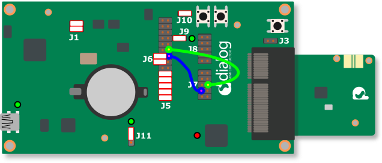
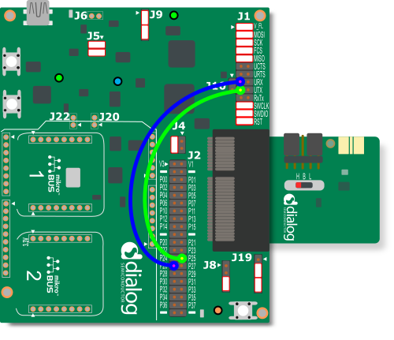

# Ticos for the DA145xx Family of Wireless Microcontrollers

This example application shows an integration with Dialog Semiconductor's SDK6
for the DA145xx family of Wireless Microcontrollers.

## Getting Started

We assume you have a working setup for firmware development on the Dialog
DA145xx family of devices:

- have Dialogs SmartSnippets Studio installed OR the Keil MDK
- have installed the latest version of the DA145xx SDK (this example was tested
  with version 6.0.14.1114)

### Adding Ticos to the Dialog SDK

Create a directory called `ticos` in the `third_party` folder of the Dialog
SDK and then clone the `ticos-firmware-sdk` repository into this folder. The
resulting directory structure should look like the following:

```
<DIALOG_SDK_ROOT>
├── README.md
├── binaries
├── config
├── doc
├── projects
├── sdk
├── third_party
│   ├── README
│   ├── crc32
│   ├── hash
│   ├── irng
│   ├── ticos
│   │   └── ticos-firmware-sdk
│   │       ├── cmake
│   │       ├── components
│   │       ├── examples
│   │       ├── makefiles
│   │       ├── ports
│   │       ├── scripts
│   │       ├── tasks
│   │       └── tests
│   ├── micro_ecc
│   └── rand
└── utilities
```

## Using the demo app

The demo app is compatible with the following DA145xx Development Kit boards:

[DA14585 Development Kit PRO](https://www.dialog-semiconductor.com/products/bluetooth-low-energy/da14585-development-kit-pro)

[DA14531 Development Kit PRO](https://www.dialog-semiconductor.com/products/bluetooth-low-energy/da14530-and-da14531-development-kit-pro)

### Hardware Configuration

**DA14585 Development Kit PRO configuration**

The jumpers on the DA14585 Development Kit PRO board must be configured as shown
below when running this example (and the jumper wires shown must be added):



**DA14531 Development Kit PRO configuration**

The jumpers on the DA14531 Development Kit PRO board must be configured as shown
below when running this example (and the jumper wires shown must be added):



### Building the demo app

The demo application can be built using either the Eclipse/GCC (SmartSnippets
Studio) toolchain or the Keil MDK:

#### SmartSnippets Studio

First, a few small changes must be made to the Dialog SDK to enable integration
of Ticos support. To make these changes navigate to the root of the Dialog
SDK and apply the following patches:

`git apply --ignore-whitespace third_party/ticos/ticos-firmware-sdk/ports/dialog/da145xx/gnu-build-id.patch`

`git apply --ignore-whitespace third_party/ticos/ticos-firmware-sdk/ports/dialog/da145xx/gcc-hardfault.patch`

Next, open SmartSnipperts Studio and import the demo application project, which
can be found in the following location:

`<DIALOG_SDK_ROOT>/third_party/ticos/ticos-firmware-sdk/examples/dialog/da145xx/apps/ticos_demo_app/Eclipse`

Build the application and then program into the flash memory contained on the
Development Kit board.

**NOTE:** A SmartSnippets Studio project is not available for the DA14531 based
example as building the example with the GCC compiler exhausts the available
memory. Use the Keil toolchain to build the example for the DA14531 (see
instructions below).

#### Keil MDK

First, a number of changes must be made to the Dialog SDK to enable integration
of Ticos support. To make these changes navigate to the root of the Dialog
SDK and apply the following patch:

`git apply --ignore-whitespace third_party/ticos/ticos-firmware-sdk/ports/dialog/da145xx/armcc-fault-handler.patch`

Next, use the Keil IDE to open the demo application project, which can be found
in the following location:

`<DIALOG_SDK_ROOT>\third_party\ticos\ticos-firmware-sdk\examples\dialog\da145xx\apps\ticos_demo_app`

Build the application and then program into the flash memory contained on the
Development Kit board.

### Running the demo app

The demo app is a simple console based app that has commands to cause a crash in
several ways. Once a coredump is captured, it can be sent to Ticos's web
services to get analyzed.

Once the DA145xx Development Kit has been programmed, connect to it using a
Terminal emulator (such as TeraTerm etc.) at 115200-8-N-1.

**NOTE**: The DA145xx will enumerate two COM ports when connected to a PC,
select the lowest numbered of the two ports when connecting via a terminal
emulator.

The following commands are supported by the demo app and can be initiated by
sending the command listed:

- crash: Generate different types of crashes with crash [0..3]
- trace: Generate a trace event (not available on the DA14531)
- get_core: Get coredump (not available on the DA14531)
- clear_core: Clear coredump (not available on the DA14531)
- test_storage: Test coredump storage (not available on the DA14531)
- get_device_info: Display device information (not available on the DA14531)
- reboot: Reboot & record event
- export: Export chunk
- help: show list of available commands
